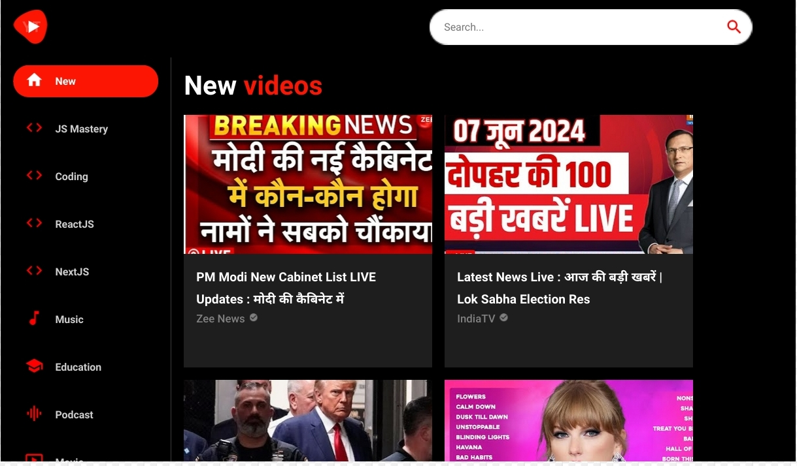

# Youtube Clone

Youtube Clone

## Technologies Used

- **React**: Frontend framework for building dynamic and interactive user interfaces.
- **Tailwind CSS**: Utility-first CSS framework for rapid UI development and customization.
- **vite** : a build tool that aims to provide a faster and leaner development experience for modern web projects
## Screenshots

## Getting Started

To run the project locally, follow these steps:

1. Clone the repository: `git clone <repository_url>`
2. Navigate to the project directory: `cd youtube`
3. Install dependencies: `npm install`
4. Start the development server: `npm run dev`

## License

This project is licensed under the [MIT License](LICENSE).